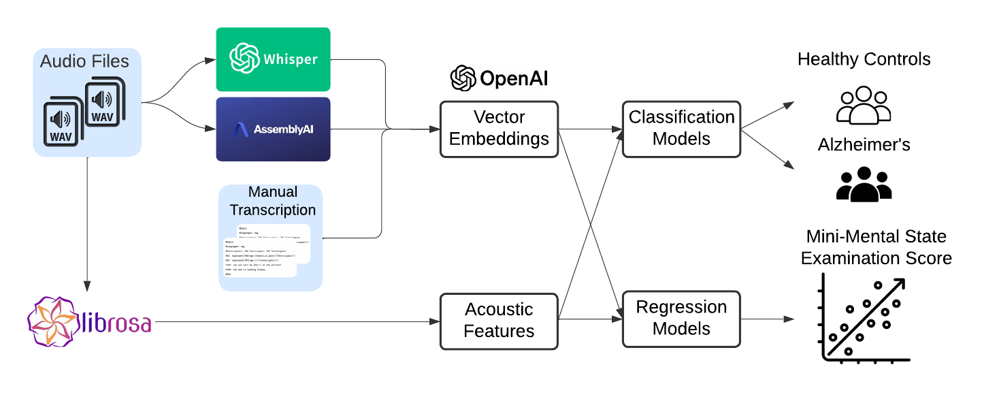

# Alzheimer's Classfification using Vector Embedding of Audio transcription

Alzheimer's disease (AD) is the most common form of dementia and represents an increasingly urgent global public health challenge. One in six people over 65 years old in the United States currently lives with Alzheimer's disease. The number of Alzheimer's patients will almost double every 20 years, reaching 78 million in 2030 and 319 million in 2050 worldwide.

Although there is no cure for Alzheimer's disease, medications can improve its symptoms and slow down the cognitive decline. Detecting AD in its early stage is crucial for managing the progression of the disease and planning care strategies. Researchers have explored various methods to detect AD in its early stages, including cognitive testing,  neuroimaging analysis, genetic risk profiling, blood biomarker tests, etc. However, many of those clinical approaches are costly and not equally accessible for all populations.

Speech disfluency, as shown in the temporal characteristics of spontaneous speech, could be early signs of Alzheimer's disease. Speech analysis has merged as a promising approach due to its non-invasive low-cost nature, and compatibility with telemedicine technologies. The Pitt Corpus from DementiaBank provides a balanced and standardized dataset, enabling researchers to compare results across different classfication models.

Large Language Models (LLMs) are deep learning neural networks. Vector embedding is a process to turn text data into a dense vector in a high-dimentional space. The similarity of data can now be measured by the distance of the vector space. Vector embedding can be used for classification. Agbavor and Liang (see reference below) has used GPT-3's Ada and Babbage base models to generate good AD classification results, and showed adding acoustic features only marginally improved the model performance.

We developed a pipeline to automatically generate audio transcription files, create vector embeddings using the latest LLM models, and apply various deep learning models to distinguish Alzheimer's disease patients from healthy controls.

## System Diagram
 

    

1. `pip3 install -r requirements.txt`

2. install Python spaCy NLP package:  `python -m spacy download en_core_web_sm`

3. Install ffmpeg: Once Homebrew is installed, run the following command to install ffmpeg:

`brew install ffmpeg`

4. Run the main.py file

`python ./main.py`

